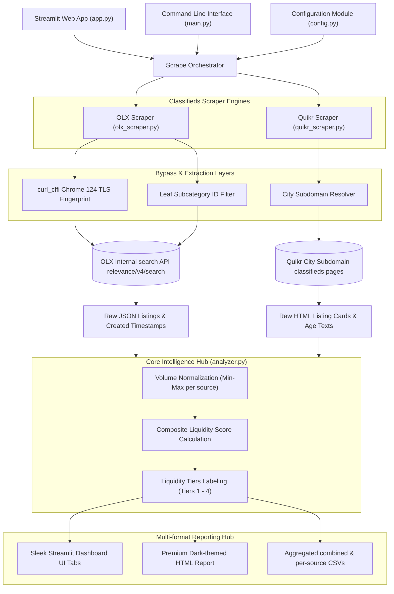

# Vingo — C2C Category Liquidity Research Tool ⚡

**Vingo** is a high-fidelity market intelligence and scraping platform built to analyze Consumer-to-Consumer (C2C) transaction liquidity across Indian cities. Designed specifically for marketplace startups, Vingo helps pinpoint which product categories possess the highest active demand and velocity (volume × freshness), letting you strategically select your launch categories.

The tool aggregates and normalizes classified listings data from **OLX** and **Quikr** across major Indian metropolitan areas: **Bangalore, Mumbai, Delhi, Hyderabad, Chennai, Pune, Kolkata, Ahmedabad, and Jaipur**.

---

## 🛠 1. System Architecture

The following flow chart shows how the application orchestrates scraping, bypasses security layers, processes the metrics, and delivers findings:



---

## ⚡ 2. Core Features & Scraping Mechanics

### A. Bypassing OLX Akamai Bot Protection
OLX India is protected by Akamai Bot Manager, which rejects standard HTTP clients (like `requests` or `httpx`) causing socket timeouts or 403 Forbidden screens. 
- **The Solution:** Vingo utilizes `curl_cffi` to impersonate a **Chrome 124 TLS client fingerprint**, allowing the scraper to communicate directly with OLX's internal endpoints undetected.

### B. Precise Leaf Category Filtering
OLX's internal API (`/api/relevance/v4/search`) ignores high-level parent category IDs (returning a massive, unfiltered 100k+ global city feed).
- **The Solution:** Vingo targets exact, verified **leaf subcategory IDs** (e.g. `1453` for Mobile Phones, `81` for Motorcycles, `1523` for TVs) extracted directly from the OLX web application state. This guarantees highly specific and accurate category metrics.

### C. The Liquidity Score Formula
The **Liquidity Score (0–100)** measures the heartbeat of a category:
$$\text{Liquidity Score} = (\text{Normalized Volume} \times 40\%) + (\text{7-Day Freshness} \times 40\%) + (\text{24-Hour Freshness} \times 20\%)$$
* **Normalized Volume (40%)**: Normalized using min-max scaling to represent category size relative to others on the same source.
* **7-Day Freshness (40%)**: Percentage of sampled listings posted within the last 7 days.
* **24-Hour Freshness (20%)**: Percentage of sampled listings posted in the last 24 hours.

---

## 🚀 3. Getting Started & Installation

### Prerequisite Dependencies
Ensure Python 3.10+ is installed on your computer. Install the verified package requirements:

```bash
pip install -r requirements.txt
```

---

## 💻 4. Running the Dashboard (Streamlit Frontend)

To launch the premium, interactive web interface:

```bash
streamlit run app.py
```
This starts a local development server at **`http://localhost:8501`** and opens the interactive launch prioritizer dashboard in your browser.

---

## 📟 5. Running the CLI (Command Line Interface)

Alternatively, orchestrate campaigns directly from the console:

```bash
# Run a quick scan for Bangalore (default)
python main.py --quick --no-cache

# Run a full campaign for Mumbai
python main.py --city mumbai

# Scrape OLX only for Delhi
python main.py --city delhi --sources olx

# Show all supported cities
python main.py --list-cities
```

Outputs are automatically saved inside a newly created `/output` directory as raw JSONs, CSVs, and an offline premium dark-themed HTML report.
